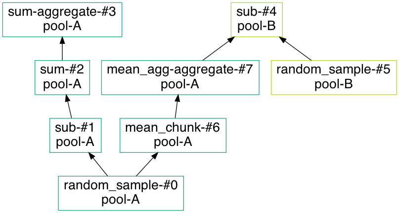

# dask-worker-pools

[](https://results.pre-commit.ci/latest/github/gjoseph92/dask-worker-pools/main)

Assign tasks to pools of workers in dask. Schedule downstream tasks to also run in the appropriate pool, reducing data transfer.

Meant for situations where communication costs between different pools of workers is very high.

```
# Launch some workers in "pool A"
$ dask-worker <scheduler_addr> --resources "pool-A=1"
$ dask-worker <scheduler_addr> --resources "pool-A=1"
$ dask-worker <scheduler_addr> --resources "pool-A=1"

# Launch some workers in "pool B"
$ dask-worker <scheduler_addr> --resources "pool-B=1"
$ dask-worker <scheduler_addr> --resources "pool-B=1"
```

```python
import dask.array as da
from dask_worker_pools import pool, propagate_pools, visualize_pools


with pool("A"):
    # Only pool-A workers can access this proprietary random data!
    a = da.random.random((10, 10))

with pool("B"):
    # Only pool-B workers can access this proprietary random data!
    b = da.random.random(10)

run_in_a = (a - 1).sum()
# ^ Want this to run only in A (transferring A data to B is expensive)

run_in_b = b - a.mean()
# ^ Want this to run in B, because `a.mean()` is smaller to transfer than all of `b`


with propagate_pools():
    # ^ Automatically propagates pool restrictions forward
    dask.compute(run_in_a, run_in_b)

visualize_pools(run_in_a, run_in_b, filename="pools.png")
```



## How it works

Using Dask's built-in [resource annotation capabilities](http://distributed.dask.org/en/stable/resources.html), it's easy to make an arbitrary "resource" like `pool-A` or `pool-B`, and assign all workers in the same data center / rack / etc. that resource.

It's also easy to `dask.annotate` certain tasks to require that resource, and therefore run only on that pool of workers. You'd do that if dataset A was only stored on workers in pool A, for example.

The trickier part is annotating where downstream tasks should run. For example, `b - a.mean()` should run in `b`'s pool, because transferring `a.mean()` from A to B is much smaller than transferring the full `b` dataset from B to A.

You could annotate all this by hand, but that's tedious:

```python
import dask
import dask.array as da

with dask.annotate(resources={"pool-A": 0}):
    a = da.random.random((10, 10))

with dask.annotate(resources={"pool-B": 0}):
    b = da.random.random(10)

with dask.annotate(resources={"pool-A": 0}):
    run_in_a = (a - 1).sum()

with dask.annotate(resources={"pool-B": 0}):
    run_in_b = b - a.mean()

```

Instead, `propagate_pools()` registers a [Dask optimization](https://docs.dask.org/en/stable/optimize.html#customizing-optimization) that automatically propagates worker-pool annotations forward. When a task requires input from multiple worker pools, it selects the one that would require the least data transfer.

So by just annotating the objects that _need_ to run in a certain pool, everything that depends on them gets annotated with the appropriate pool too.

### Flaws

* Doesn't identify when restricting an operation to one pool just isn't worth it.

  For example, if `a` and `b` are equal-size arrays in different pools, `a + b` should have no restrictions—there's no gain from that. In fact, restricting it will probably make memory usage worse in the unlucky pool.
* Doesn't back-propagate pool selections to unrestricted inputs.

  For example, in `a + any_pool`, it would be smart to restrict `any_pool` to A (assuming it's only used in this operation), so that it doesn't accidentally run somewhere else and then have to be transferred _into_ A.
* Can't use `with pool(None)` to explicitly block restrictions from being applied to a task.

## Installation
```
python -m pip install git+https://github.com/gjoseph92/dask-worker-pools.git@main
```
